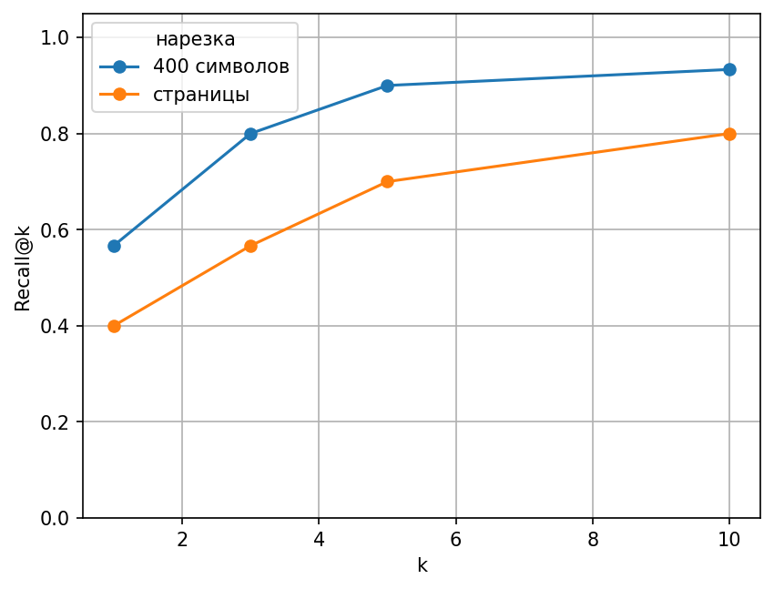
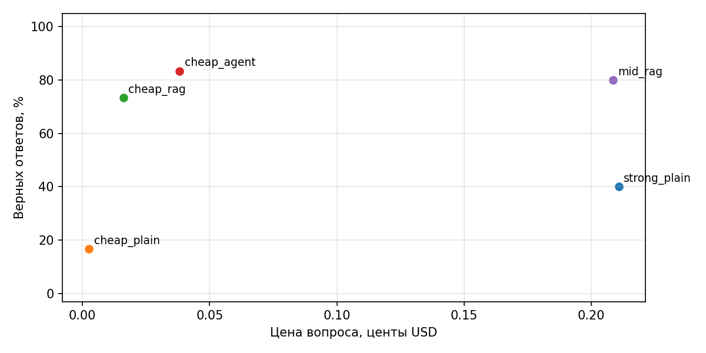
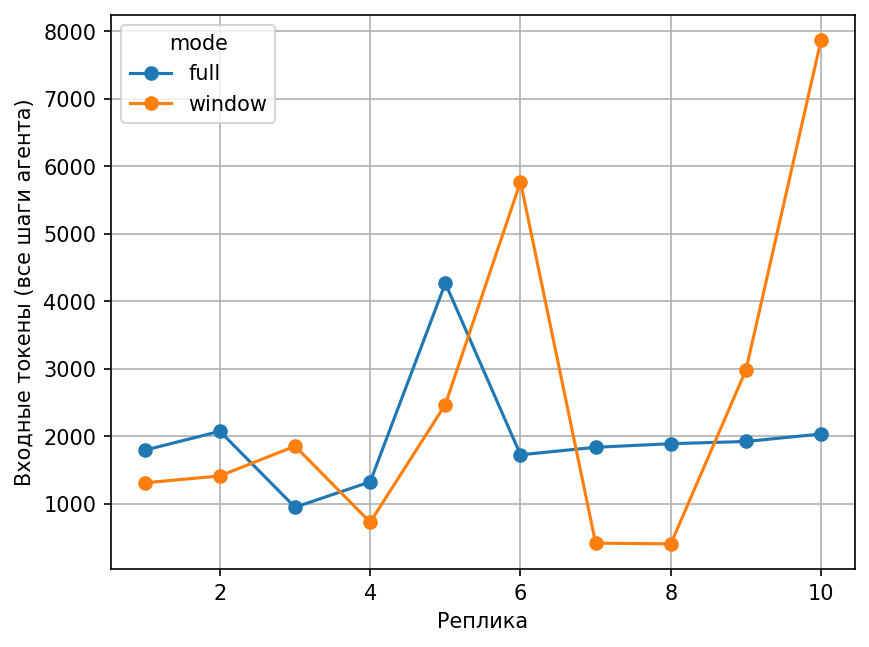

# ДЗ 2

RAG и память по книге Ткачука «Математика — абитуриенту», 2018. Код из семинара доработан с помощью Codex. Замеры: 27.09.2026.

В ноутбуке поставить `RECOMPUTE = True` и запустить ячейки сверху вниз. Ответы считаются по очереди. Сохранённые ответы пропускаются. Для нового замера перенести папку `results` и создать пустую; кэш оставить. Лимит расходов в `.env` действует на один запуск.

Данные — `data`, результаты — `results/results.json`. Ключ и личная память не входят в git.

## Данные и поиск

`corpus.jsonl` — текст PDF после pypdf: 931 страница. Исходный PDF лежит рядом: [Ткачук](data/1611656236_matematika-abiturientu_tkachuk-v_v_2018-18-e-izd-944s.pdf). Для работы используется готовый JSONL. Две нарезки: страницы и 4656 кусков по 400 символов без перекрытия. У кусков сохранены файл и номер страницы PDF, который может отличаться от печатного.

Есть 30 вопросов по вводной части на 12 страницах и 10 без ответа. Поиск идёт по всей книге. Формулы исключены: pypdf портит символы, а нарезка это не исправляет.

Эмбеддинги: `text-embedding-3-small`, 512 чисел, сохранены в кэш. Кусок считается верным по файлу, странице, ответу и половине слов цитаты. Это приблизительная проверка.

Выбрал 400 символов и k=5: NumPy нашёл 27/30 ответов, при k=10 — 28/30. Подбор сделан на тех же вопросах.

| Нарезка | Поиск | Recall@1 | Recall@5 | Recall@10 |
| --- | --- | --- | --- | --- |
| 400 символов | вектор | 56.7% | 90.0% | 93.3% |
| 400 символов | слова | 50.0% | 73.3% | 80.0% |
| 400 символов | гибрид RRF | 63.3% | 86.7% | 90.0% |

Поиск по словам использует IDF, гибрид — RRF. Гибрид не улучшил Recall@5. В Milvus загружено 4656 кусков, показан фильтр `pdf_page <= 30`. Реальный Recall@5 с AUTOINDEX — 80%, ниже 90% у NumPy.

## Ответы

Вместо живого поиска для этого корпуса взята дешёвая модель без инструментов.

| Конфигурация | Верных / 30 | Точность | USD / вопрос | USD / верный ответ |
| --- | --- | --- | --- | --- |
| Sonnet без инструментов | 12 | 40.0% | 0.002108 | 0.005269 |
| GPT-4o mini без инструментов | 5 | 16.7% | 0.000026 | 0.000156 |
| GPT-4o mini + RAG всегда | 22 | 73.3% | 0.000161 | 0.000220 |
| GPT-4o mini + агент с базой | 25 | 83.3% | 0.000382 | 0.000458 |
| Haiku + RAG всегда | 24 | 80.0% | 0.002085 | 0.002607 |

Цена из API, по 30 вопросам с ответом. Цена верного ответа — расходы / число верных. Старые расходы на эмбеддинги неизвестны и не учтены. Автооценку проверил Codex; исправления синонимов и исходные ответы есть в `results.json`.

| Конфигурация | Честных отказов / 10 | Ложных отказов / 30 |
| --- | --- | --- |
| Sonnet без инструментов | 10 | 13 |
| GPT-4o mini без инструментов | 10 | 16 |
| GPT-4o mini + RAG всегда | 10 | 2 |
| GPT-4o mini + агент с базой | 10 | 1 |
| Haiku + RAG всегда | 10 | 4 |

Отказ обычным текстом тоже считается. Вопросы без ответа простые, поэтому 10/10 не гарантирует такой же результат на других данных.

## Ошибки

У агента с базой 5 ошибок, во всех не найден нужный кусок.

- Вопрос 23: вместо главы «Шпаргалки» (PDF, стр. 27) агент ответил «Справочные материалы». Нужно улучшить поиск.
- Пример ошибки генерации взят из обычного RAG: в вопросе 3 нужный текст найден, но модель добавила ЕГЭ, хотя источник прямо исключает такие задания. Нужно точнее следовать источнику.

## Память

Журнал с временем и сессией хранится в файле, в контекст не попадает. В конце сессии дешёвая модель извлекает факты для Milvus. Новый факт заменяет старый.

В примере — Влад из Екатеринбурга. Во второй сессии вспомнились имя и цель; город сохранился в базе, но не попал в три найденных факта. Предпочтение к коротким ответам заменилось на подробные.

| Контекст | Входных токенов | USD за 10 реплик |
| --- | --- | --- |
| full | 19810 | 0.003164 |
| window | 25214 | 0.004243 |

Одинаковые 10 реплик. `full` — вся история; `window` — последние четыре сообщения и три факта. В этом запуске с памятью входных токенов на 27.3% больше: модель делала больше шагов с инструментом и давала другие ответы. Экономии не получилось. Извлечение фактов: ещё $0.000182.

Проходят 6 тестов без модели: 3 для инструмента и 3 для памяти. База в тестах подменена; настоящая проверена в демонстрации.

## Вывод

Агент с базой дал 25/30 против 12/30 у сильной модели без базы. Верный ответ дешевле примерно в 11.5 раза. Память в этом запуске не сэкономила токены и деньги. Всего потрачено $0.202585. С прошлой неделей не сравнивал: другой корпус. Второй бонус не делал.
